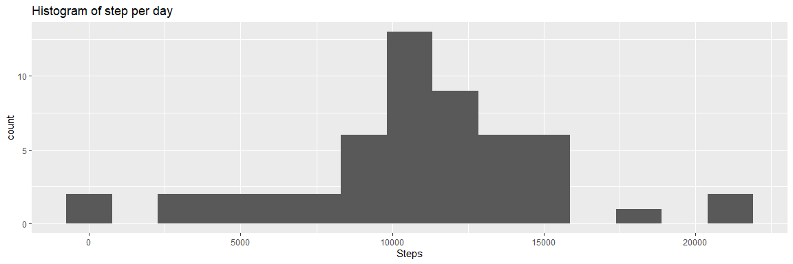
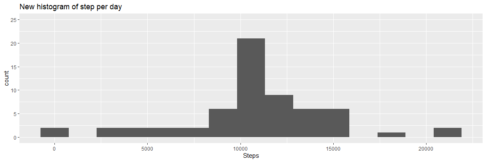
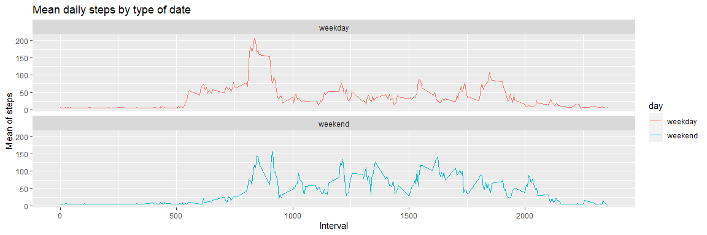

PA1\_template
================
Nuts B
17/8/2563

## Download Library and data

``` r
library(ggplot2)
```

    ## Warning: package 'ggplot2' was built under R version 4.0.2

``` r
library(tidyverse)
```

    ## Warning: package 'tidyverse' was built under R version 4.0.2

    ## -- Attaching packages ----------------

    ## v tibble  3.0.1     v dplyr   1.0.0
    ## v tidyr   1.1.0     v stringr 1.4.0
    ## v readr   1.3.1     v forcats 0.5.0
    ## v purrr   0.3.4

    ## Warning: package 'readr' was built under R version 4.0.2

    ## -- Conflicts -------------------------
    ## x dplyr::filter() masks stats::filter()
    ## x dplyr::lag()    masks stats::lag()

``` r
activity <- read_csv("activity.csv")
```

    ## Parsed with column specification:
    ## cols(
    ##   steps = col_double(),
    ##   date = col_date(format = ""),
    ##   interval = col_double()
    ## )

``` r
activity$date <- as.POSIXct(activity$date, "%Y-%m-%d")
glimpse(activity)
```

    ## Rows: 17,568
    ## Columns: 3
    ## $ steps    <dbl> NA, NA, NA, NA, NA, NA, NA, NA, NA, NA, NA, NA, NA, NA, NA...
    ## $ date     <dttm> 2012-10-01 07:00:00, 2012-10-01 07:00:00, 2012-10-01 07:0...
    ## $ interval <dbl> 0, 5, 10, 15, 20, 25, 30, 35, 40, 45, 50, 55, 100, 105, 11...

``` r
summary(activity)
```

    ##      steps             date                        interval     
    ##  Min.   :  0.00   Min.   :2012-10-01 07:00:00   Min.   :   0.0  
    ##  1st Qu.:  0.00   1st Qu.:2012-10-16 07:00:00   1st Qu.: 588.8  
    ##  Median :  0.00   Median :2012-10-31 07:00:00   Median :1177.5  
    ##  Mean   : 37.38   Mean   :2012-10-31 07:00:00   Mean   :1177.5  
    ##  3rd Qu.: 12.00   3rd Qu.:2012-11-15 07:00:00   3rd Qu.:1766.2  
    ##  Max.   :806.00   Max.   :2012-11-30 07:00:00   Max.   :2355.0  
    ##  NA's   :2304

## What is mean total number of steps taken per day

1.Calculate the total number of steps taken per day

``` r
stepsPerDay <- aggregate(steps ~ date, activity, sum, na.rm=TRUE)
stepsPerDay
```

    ##                   date steps
    ## 1  2012-10-02 07:00:00   126
    ## 2  2012-10-03 07:00:00 11352
    ## 3  2012-10-04 07:00:00 12116
    ## 4  2012-10-05 07:00:00 13294
    ## 5  2012-10-06 07:00:00 15420
    ## 6  2012-10-07 07:00:00 11015
    ## 7  2012-10-09 07:00:00 12811
    ## 8  2012-10-10 07:00:00  9900
    ## 9  2012-10-11 07:00:00 10304
    ## 10 2012-10-12 07:00:00 17382
    ## 11 2012-10-13 07:00:00 12426
    ## 12 2012-10-14 07:00:00 15098
    ## 13 2012-10-15 07:00:00 10139
    ## 14 2012-10-16 07:00:00 15084
    ## 15 2012-10-17 07:00:00 13452
    ## 16 2012-10-18 07:00:00 10056
    ## 17 2012-10-19 07:00:00 11829
    ## 18 2012-10-20 07:00:00 10395
    ## 19 2012-10-21 07:00:00  8821
    ## 20 2012-10-22 07:00:00 13460
    ## 21 2012-10-23 07:00:00  8918
    ## 22 2012-10-24 07:00:00  8355
    ## 23 2012-10-25 07:00:00  2492
    ## 24 2012-10-26 07:00:00  6778
    ## 25 2012-10-27 07:00:00 10119
    ## 26 2012-10-28 07:00:00 11458
    ## 27 2012-10-29 07:00:00  5018
    ## 28 2012-10-30 07:00:00  9819
    ## 29 2012-10-31 07:00:00 15414
    ## 30 2012-11-02 07:00:00 10600
    ## 31 2012-11-03 07:00:00 10571
    ## 32 2012-11-05 07:00:00 10439
    ## 33 2012-11-06 07:00:00  8334
    ## 34 2012-11-07 07:00:00 12883
    ## 35 2012-11-08 07:00:00  3219
    ## 36 2012-11-11 07:00:00 12608
    ## 37 2012-11-12 07:00:00 10765
    ## 38 2012-11-13 07:00:00  7336
    ## 39 2012-11-15 07:00:00    41
    ## 40 2012-11-16 07:00:00  5441
    ## 41 2012-11-17 07:00:00 14339
    ## 42 2012-11-18 07:00:00 15110
    ## 43 2012-11-19 07:00:00  8841
    ## 44 2012-11-20 07:00:00  4472
    ## 45 2012-11-21 07:00:00 12787
    ## 46 2012-11-22 07:00:00 20427
    ## 47 2012-11-23 07:00:00 21194
    ## 48 2012-11-24 07:00:00 14478
    ## 49 2012-11-25 07:00:00 11834
    ## 50 2012-11-26 07:00:00 11162
    ## 51 2012-11-27 07:00:00 13646
    ## 52 2012-11-28 07:00:00 10183
    ## 53 2012-11-29 07:00:00  7047

2.  If you do not understand the difference between a histogram and a
    barplot, research the difference between them. Make a histogram of
    the total number of steps taken each day

<!-- end list -->

``` r
plot1 <- ggplot(stepsPerDay,aes(steps)) + geom_histogram(bins = 15) 
plot1 +labs(title = "Histogram of step per day", x= "Steps")
```

<!-- -->

``` r
print(paste("Mean of total number of step per day is", round(mean(stepsPerDay$steps),digits = 2)))
```

    ## [1] "Mean of total number of step per day is 10766.19"

``` r
print(paste("Median of total number of step per day is", median(stepsPerDay$steps)))
```

    ## [1] "Median of total number of step per day is 10765"

## What is the average daily activity pattern?

1.Make a time series plot (i.e. type = “l”) of the 5-minute interval
(x-axis) and the average number of steps taken, averaged across all days
(y-axis)

``` r
stepsPerInterval<-aggregate(steps~interval, data=activity, mean, na.rm=TRUE)
stepsPerInterval
```

    ##     interval       steps
    ## 1          0   1.7169811
    ## 2          5   0.3396226
    ## 3         10   0.1320755
    ## 4         15   0.1509434
    ## 5         20   0.0754717
    ## 6         25   2.0943396
    ## 7         30   0.5283019
    ## 8         35   0.8679245
    ## 9         40   0.0000000
    ## 10        45   1.4716981
    ## 11        50   0.3018868
    ## 12        55   0.1320755
    ## 13       100   0.3207547
    ## 14       105   0.6792453
    ## 15       110   0.1509434
    ## 16       115   0.3396226
    ## 17       120   0.0000000
    ## 18       125   1.1132075
    ## 19       130   1.8301887
    ## 20       135   0.1698113
    ## 21       140   0.1698113
    ## 22       145   0.3773585
    ## 23       150   0.2641509
    ## 24       155   0.0000000
    ## 25       200   0.0000000
    ## 26       205   0.0000000
    ## 27       210   1.1320755
    ## 28       215   0.0000000
    ## 29       220   0.0000000
    ## 30       225   0.1320755
    ## 31       230   0.0000000
    ## 32       235   0.2264151
    ## 33       240   0.0000000
    ## 34       245   0.0000000
    ## 35       250   1.5471698
    ## 36       255   0.9433962
    ## 37       300   0.0000000
    ## 38       305   0.0000000
    ## 39       310   0.0000000
    ## 40       315   0.0000000
    ## 41       320   0.2075472
    ## 42       325   0.6226415
    ## 43       330   1.6226415
    ## 44       335   0.5849057
    ## 45       340   0.4905660
    ## 46       345   0.0754717
    ## 47       350   0.0000000
    ## 48       355   0.0000000
    ## 49       400   1.1886792
    ## 50       405   0.9433962
    ## 51       410   2.5660377
    ## 52       415   0.0000000
    ## 53       420   0.3396226
    ## 54       425   0.3584906
    ## 55       430   4.1132075
    ## 56       435   0.6603774
    ## 57       440   3.4905660
    ## 58       445   0.8301887
    ## 59       450   3.1132075
    ## 60       455   1.1132075
    ## 61       500   0.0000000
    ## 62       505   1.5660377
    ## 63       510   3.0000000
    ## 64       515   2.2452830
    ## 65       520   3.3207547
    ## 66       525   2.9622642
    ## 67       530   2.0943396
    ## 68       535   6.0566038
    ## 69       540  16.0188679
    ## 70       545  18.3396226
    ## 71       550  39.4528302
    ## 72       555  44.4905660
    ## 73       600  31.4905660
    ## 74       605  49.2641509
    ## 75       610  53.7735849
    ## 76       615  63.4528302
    ## 77       620  49.9622642
    ## 78       625  47.0754717
    ## 79       630  52.1509434
    ## 80       635  39.3396226
    ## 81       640  44.0188679
    ## 82       645  44.1698113
    ## 83       650  37.3584906
    ## 84       655  49.0377358
    ## 85       700  43.8113208
    ## 86       705  44.3773585
    ## 87       710  50.5094340
    ## 88       715  54.5094340
    ## 89       720  49.9245283
    ## 90       725  50.9811321
    ## 91       730  55.6792453
    ## 92       735  44.3207547
    ## 93       740  52.2641509
    ## 94       745  69.5471698
    ## 95       750  57.8490566
    ## 96       755  56.1509434
    ## 97       800  73.3773585
    ## 98       805  68.2075472
    ## 99       810 129.4339623
    ## 100      815 157.5283019
    ## 101      820 171.1509434
    ## 102      825 155.3962264
    ## 103      830 177.3018868
    ## 104      835 206.1698113
    ## 105      840 195.9245283
    ## 106      845 179.5660377
    ## 107      850 183.3962264
    ## 108      855 167.0188679
    ## 109      900 143.4528302
    ## 110      905 124.0377358
    ## 111      910 109.1132075
    ## 112      915 108.1132075
    ## 113      920 103.7169811
    ## 114      925  95.9622642
    ## 115      930  66.2075472
    ## 116      935  45.2264151
    ## 117      940  24.7924528
    ## 118      945  38.7547170
    ## 119      950  34.9811321
    ## 120      955  21.0566038
    ## 121     1000  40.5660377
    ## 122     1005  26.9811321
    ## 123     1010  42.4150943
    ## 124     1015  52.6603774
    ## 125     1020  38.9245283
    ## 126     1025  50.7924528
    ## 127     1030  44.2830189
    ## 128     1035  37.4150943
    ## 129     1040  34.6981132
    ## 130     1045  28.3396226
    ## 131     1050  25.0943396
    ## 132     1055  31.9433962
    ## 133     1100  31.3584906
    ## 134     1105  29.6792453
    ## 135     1110  21.3207547
    ## 136     1115  25.5471698
    ## 137     1120  28.3773585
    ## 138     1125  26.4716981
    ## 139     1130  33.4339623
    ## 140     1135  49.9811321
    ## 141     1140  42.0377358
    ## 142     1145  44.6037736
    ## 143     1150  46.0377358
    ## 144     1155  59.1886792
    ## 145     1200  63.8679245
    ## 146     1205  87.6981132
    ## 147     1210  94.8490566
    ## 148     1215  92.7735849
    ## 149     1220  63.3962264
    ## 150     1225  50.1698113
    ## 151     1230  54.4716981
    ## 152     1235  32.4150943
    ## 153     1240  26.5283019
    ## 154     1245  37.7358491
    ## 155     1250  45.0566038
    ## 156     1255  67.2830189
    ## 157     1300  42.3396226
    ## 158     1305  39.8867925
    ## 159     1310  43.2641509
    ## 160     1315  40.9811321
    ## 161     1320  46.2452830
    ## 162     1325  56.4339623
    ## 163     1330  42.7547170
    ## 164     1335  25.1320755
    ## 165     1340  39.9622642
    ## 166     1345  53.5471698
    ## 167     1350  47.3207547
    ## 168     1355  60.8113208
    ## 169     1400  55.7547170
    ## 170     1405  51.9622642
    ## 171     1410  43.5849057
    ## 172     1415  48.6981132
    ## 173     1420  35.4716981
    ## 174     1425  37.5471698
    ## 175     1430  41.8490566
    ## 176     1435  27.5094340
    ## 177     1440  17.1132075
    ## 178     1445  26.0754717
    ## 179     1450  43.6226415
    ## 180     1455  43.7735849
    ## 181     1500  30.0188679
    ## 182     1505  36.0754717
    ## 183     1510  35.4905660
    ## 184     1515  38.8490566
    ## 185     1520  45.9622642
    ## 186     1525  47.7547170
    ## 187     1530  48.1320755
    ## 188     1535  65.3207547
    ## 189     1540  82.9056604
    ## 190     1545  98.6603774
    ## 191     1550 102.1132075
    ## 192     1555  83.9622642
    ## 193     1600  62.1320755
    ## 194     1605  64.1320755
    ## 195     1610  74.5471698
    ## 196     1615  63.1698113
    ## 197     1620  56.9056604
    ## 198     1625  59.7735849
    ## 199     1630  43.8679245
    ## 200     1635  38.5660377
    ## 201     1640  44.6603774
    ## 202     1645  45.4528302
    ## 203     1650  46.2075472
    ## 204     1655  43.6792453
    ## 205     1700  46.6226415
    ## 206     1705  56.3018868
    ## 207     1710  50.7169811
    ## 208     1715  61.2264151
    ## 209     1720  72.7169811
    ## 210     1725  78.9433962
    ## 211     1730  68.9433962
    ## 212     1735  59.6603774
    ## 213     1740  75.0943396
    ## 214     1745  56.5094340
    ## 215     1750  34.7735849
    ## 216     1755  37.4528302
    ## 217     1800  40.6792453
    ## 218     1805  58.0188679
    ## 219     1810  74.6981132
    ## 220     1815  85.3207547
    ## 221     1820  59.2641509
    ## 222     1825  67.7735849
    ## 223     1830  77.6981132
    ## 224     1835  74.2452830
    ## 225     1840  85.3396226
    ## 226     1845  99.4528302
    ## 227     1850  86.5849057
    ## 228     1855  85.6037736
    ## 229     1900  84.8679245
    ## 230     1905  77.8301887
    ## 231     1910  58.0377358
    ## 232     1915  53.3584906
    ## 233     1920  36.3207547
    ## 234     1925  20.7169811
    ## 235     1930  27.3962264
    ## 236     1935  40.0188679
    ## 237     1940  30.2075472
    ## 238     1945  25.5471698
    ## 239     1950  45.6603774
    ## 240     1955  33.5283019
    ## 241     2000  19.6226415
    ## 242     2005  19.0188679
    ## 243     2010  19.3396226
    ## 244     2015  33.3396226
    ## 245     2020  26.8113208
    ## 246     2025  21.1698113
    ## 247     2030  27.3018868
    ## 248     2035  21.3396226
    ## 249     2040  19.5471698
    ## 250     2045  21.3207547
    ## 251     2050  32.3018868
    ## 252     2055  20.1509434
    ## 253     2100  15.9433962
    ## 254     2105  17.2264151
    ## 255     2110  23.4528302
    ## 256     2115  19.2452830
    ## 257     2120  12.4528302
    ## 258     2125   8.0188679
    ## 259     2130  14.6603774
    ## 260     2135  16.3018868
    ## 261     2140   8.6792453
    ## 262     2145   7.7924528
    ## 263     2150   8.1320755
    ## 264     2155   2.6226415
    ## 265     2200   1.4528302
    ## 266     2205   3.6792453
    ## 267     2210   4.8113208
    ## 268     2215   8.5094340
    ## 269     2220   7.0754717
    ## 270     2225   8.6981132
    ## 271     2230   9.7547170
    ## 272     2235   2.2075472
    ## 273     2240   0.3207547
    ## 274     2245   0.1132075
    ## 275     2250   1.6037736
    ## 276     2255   4.6037736
    ## 277     2300   3.3018868
    ## 278     2305   2.8490566
    ## 279     2310   0.0000000
    ## 280     2315   0.8301887
    ## 281     2320   0.9622642
    ## 282     2325   1.5849057
    ## 283     2330   2.6037736
    ## 284     2335   4.6981132
    ## 285     2340   3.3018868
    ## 286     2345   0.6415094
    ## 287     2350   0.2264151
    ## 288     2355   1.0754717

2.Which 5-minute interval, on average across all the days in the
dataset, contains the maximum number of steps?

``` r
print(paste("The interval is",stepsPerInterval[which.max(stepsPerInterval$steps),]$interval))
```

    ## [1] "The interval is 835"

## Imputing missing values

1.Calculate and report the total number of missing values in the dataset
(i.e. the total number of rows with 𝙽𝙰s)

``` r
print(paste("Number of missing value is",sum(is.na(activity))))
```

    ## [1] "Number of missing value is 2304"

2.  Devise a strategy for filling in all of the missing values in the
    dataset. The strategy does not need to be sophisticated. For
    example, you could use the mean/median for that day, or the mean for
    that 5-minute interval, etc

Replace missing value with mean

``` r
step_mean <- round(mean(stepsPerInterval$steps),digits = 2)
print(paste("Replace missing value with mean : mean =",step_mean))
```

    ## [1] "Replace missing value with mean : mean = 37.38"

3.Create a new dataset that is equal to the original dataset but with
the missing data filled in.

``` r
activity_clean<-activity
for(i in 1:nrow(activity_clean)){
    if(is.na(activity_clean[i,]$steps)){
        activity_clean[i,]$steps <- step_mean
    }
}
sum(is.na(activity_clean$steps))
```

    ## [1] 0

Missing value was replaced by mean.

4.Make a histogram of the total number of steps taken each day and
Calculate and report the mean and median total number of steps taken per
day. Do these values differ from the estimates from the first part of
the assignment? What is the impact of imputing missing data on the
estimates of the total daily number of steps?

``` r
stepsPerDay_new <- aggregate(steps ~ date, activity_clean, sum, na.rm=TRUE)
plot3 <- ggplot(stepsPerDay_new,aes(steps)) + geom_histogram(bins = 15) 
plot1 +labs(title = "Old histogram of step per day", x= "Steps") + ylim(0,25)
```

<!-- -->

``` r
plot3 +labs(title = "New histogram of step per day", x= "Steps")+ ylim(0,25)
```

<!-- -->

The new histogram seem to have more number of 10,000 count.

``` r
print(paste("Old mean of total number of step per day is", round(mean(stepsPerDay$steps),digits = 2)))
```

    ## [1] "Old mean of total number of step per day is 10766.19"

``` r
print(paste("New mean of total number of step per day is", round(mean(stepsPerDay_new$steps),digits = 2)))
```

    ## [1] "New mean of total number of step per day is 10766.09"

``` r
print(paste("Old median of total number of step per day is", round(median(stepsPerDay$steps))))
```

    ## [1] "Old median of total number of step per day is 10765"

``` r
print(paste("New median of total number of step per day is", round(median(stepsPerDay_new$steps))))
```

    ## [1] "New median of total number of step per day is 10765"

Median is the same. Mean also almost the same.

## Are there differences in activity patterns between weekdays and weekends?

1.Create a new factor variable in the dataset with two levels –
“weekday” and “weekend” indicating whether a given date is a weekday
or weekend day.

``` r
activity_clean$date <- as.Date(strptime(activity_clean$date, format="%Y-%m-%d"))
activity_clean$day <- weekdays(activity_clean$date)
for (i in 1:nrow(activity_clean)) {
    if (activity_clean[i,]$day %in% c("Saturday","Sunday")) {
        activity_clean[i,]$day<-"weekend"
    }
    else{
        activity_clean[i,]$day<-"weekday"
    }
}
```

2.Make a panel plot containing a time series plot (i.e. type = “l”) of
the 5-minute interval (x-axis) and the average number of steps taken,
averaged across all weekday days or weekend days (y-axis). See the
README file in the GitHub repository to see an example of what this plot
should look like using simulated data.

``` r
activity_by_date <- aggregate(steps~interval + day, activity_clean, mean)
plot4<- ggplot(activity_by_date, aes(x = interval , y = steps, color = day)) +
       geom_line() +
       labs(title = "Mean daily steps by type of date", x = "Interval", y = "Mean of steps") +
       facet_wrap(~day, ncol = 1, nrow=2)
plot4
```

<!-- -->
